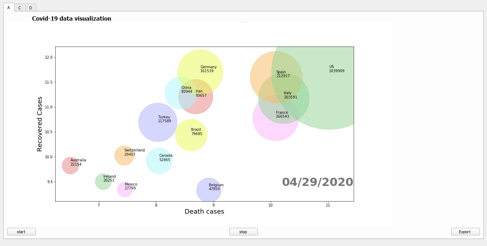
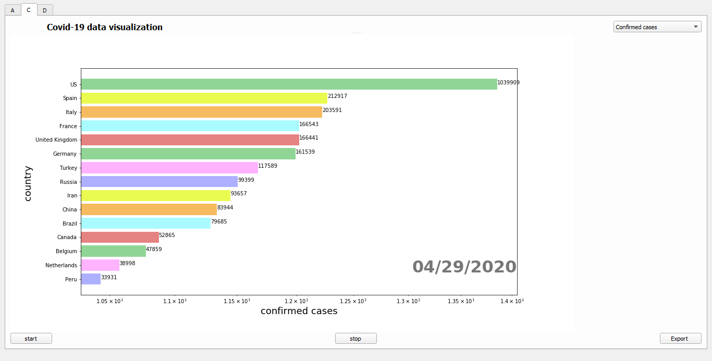
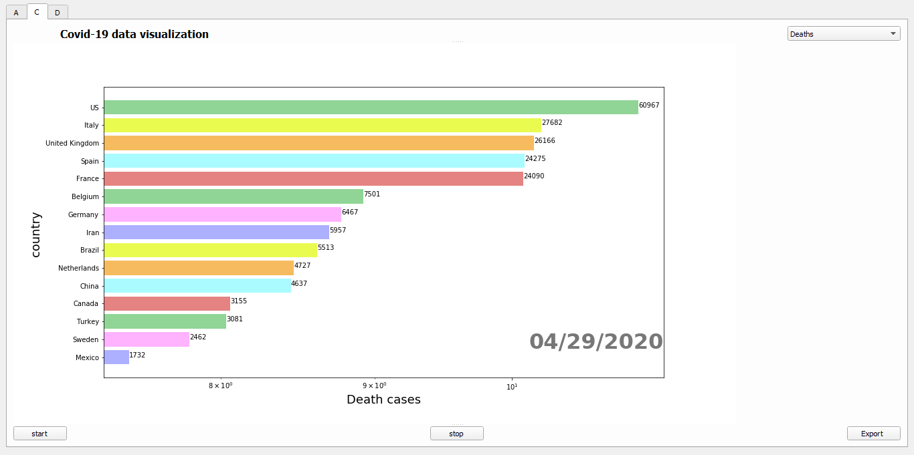
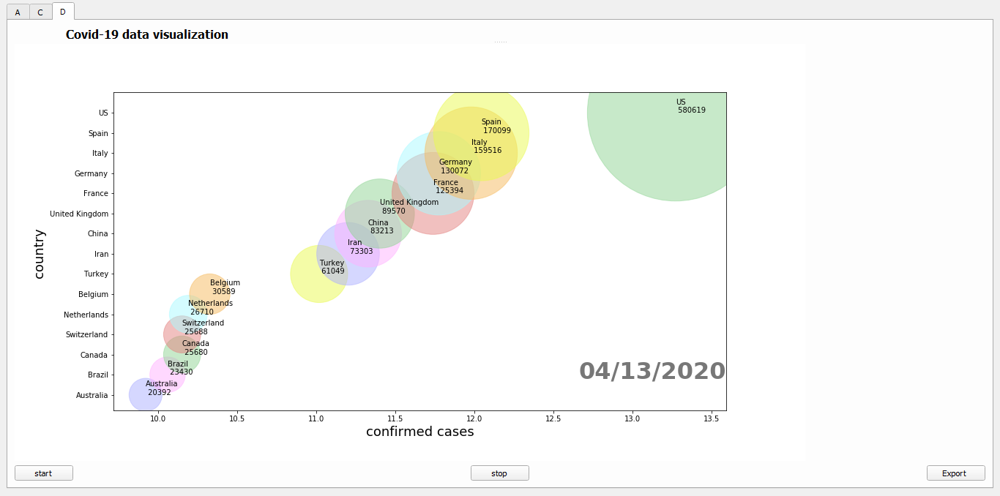

#  Covid19_Data Visualization

In this application you could see a visualization for covid19 pandemic data starting from 1/2/2020

and end in 29/4/2020.

you could control the animated graph using start and stop buttons,

you could also export this animated graph into a video using export button.

And here are some examples for the visualization of covid19 data.

**A.** Animated bubble graph: x-axis is the number of deaths, y-axis is the number of recovered cases, the size 	of each country bubble is the # of its cases.
  
 
 

**C.** Animated Sorted chart: each country is represented as bar on the chart. The length of the bar is the #cases or #deaths or both. The bars are always sorted (according to #cases or #deaths. Option in your UI) while running through time. 

1-sorting according to number of cases

2-sorting according to number of deaths

**D.** Animated bubble graph: x-axis is the number of cases, y-axis is each country , the size of each country bubble is the # of its cases.

