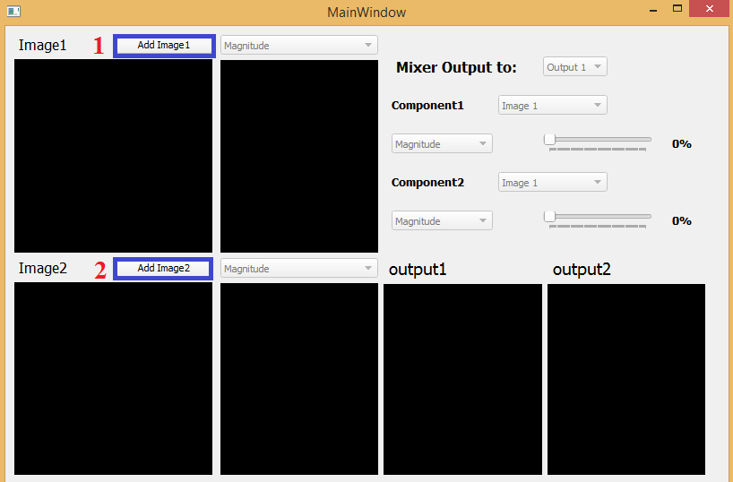
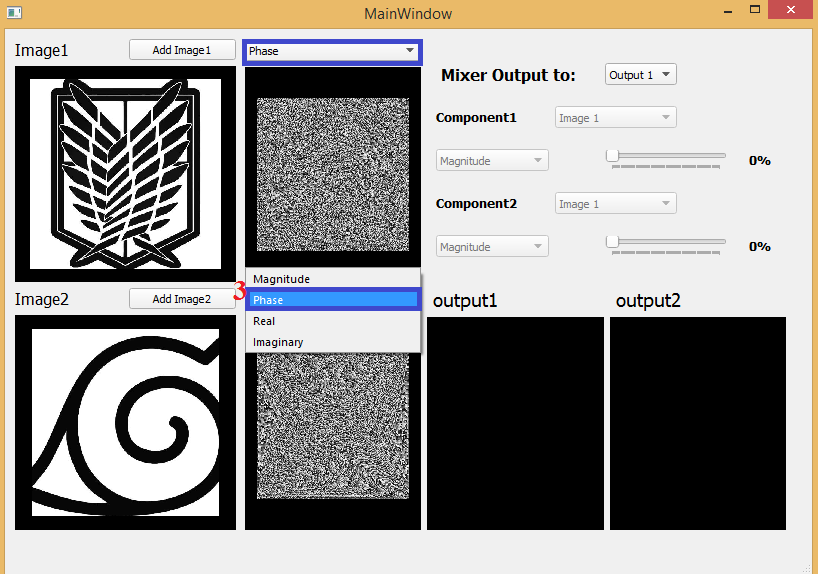
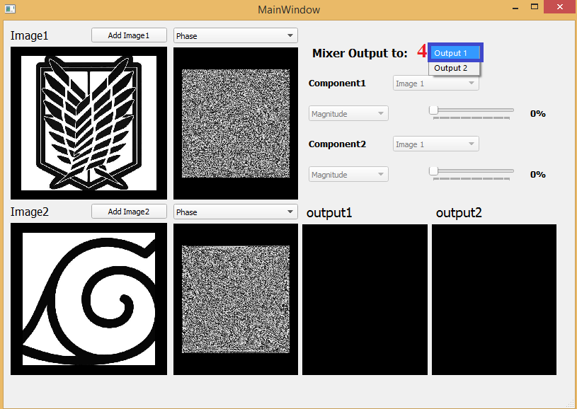
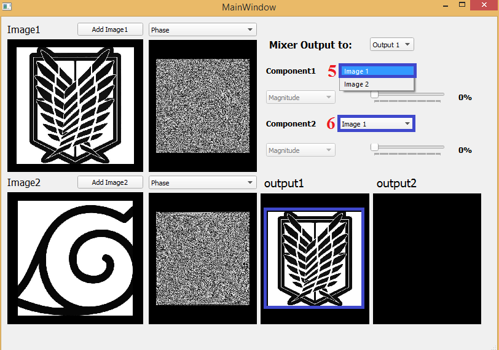
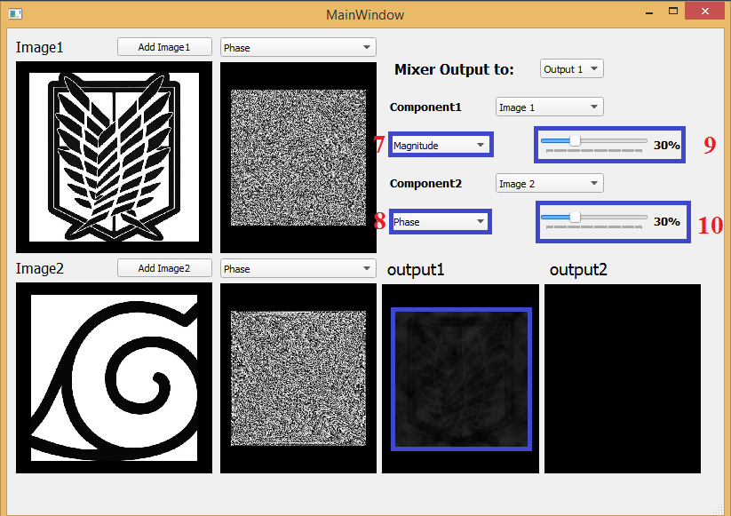
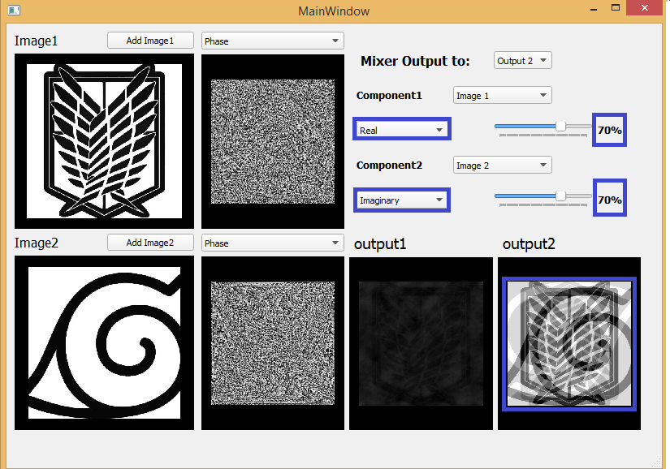
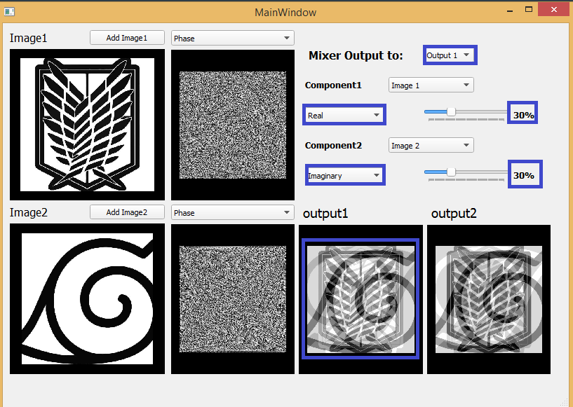

# Image Mixer

This is image Mixer Application by controlling the phase and magnitude for 2D images.

## Steps for the using the application:

**1- Start the program , add image1 and image2  to be able to use the Mixer.**

**you have to make sure that the 2 images have the same size or the app would give you a warning.**

## 

**2-You could use the 2 combo boxes shown below to display a specified Fourier transform of each image.** 

**3-Select where you would display the output of the Mixer.**

**4-When selecting the output widget:**

- **image1 would be shown by default as it represents the mixing of  0% of the magnitude of component1(image1) with 0% of the phase of component2 ( image1) and the mixing result would be image1.**

- **You would see that the Mixer component combo Boxes have been set to be enabled.**

   **select from them component1 and component2 of the mixed image.**

**5- When selecting the two components :**

- **the modes combo boxes would be enabled to select the  mixing mode of the two components from them.**

- **move the sliders to select the mixing percent of the two components  and it would give you the output.**

 **As shown below when mixing 30% of the magnitude of image1 with 30% of the phase of image2 this results to the shown output.**

**6- you could change the mode of the mixing as shown in output2.** 

**7- This is an example for the result of mixing 30% of the real part of image1 with 30% of the imaginary part of image2.** 

### Notes:

- **I have to change the shape of the GUI a little to make it resizable and it would look a little different of this.**

- **I am sorry for the huge repetition  in my code, I would try to update it as much as I can.**
